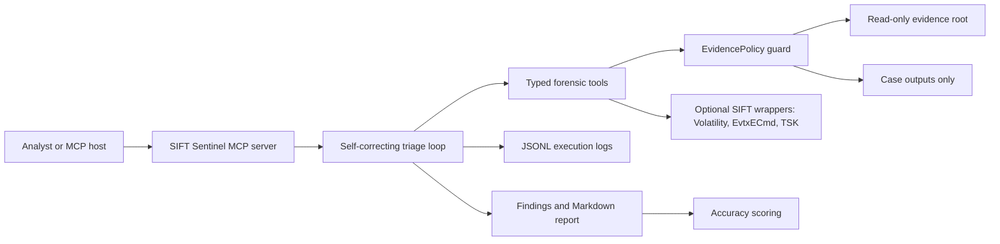

# SIFT Sentinel

Evidence-safe autonomous DFIR for Protocol SIFT.

SIFT Sentinel turns the Find Evil challenge into a concrete, judge-runnable system: a custom MCP server, a deterministic self-correcting triage agent, structured execution logs, and an accuracy benchmark. The design goal is simple: let an AI defender move fast without letting it mutate evidence or make unsupported claims.

## Why This Can Win

Protocol SIFT gives Claude Code strong DFIR instructions and tool knowledge. SIFT Sentinel adds the missing architectural enforcement layer:

- No generic shell tool is exposed to the agent.
- Every forensic operation is a typed tool with structured input and output.
- Evidence paths are read-only by policy, not by prompt.
- Generated files can only be written below the case `outputs/` directory.
- Evidence hashes are compared before and after each autonomous run.
- Findings must survive a validation pass before becoming confirmed.
- Every finding cites row-level evidence and the tool call ID that produced it.
- The benchmark scores false positives, missed truth items, and hallucinated confirmed claims.

## Architecture Pattern

Primary pattern: **Custom MCP Server**.

Supporting patterns: **Self-Correcting Triage Agent**, **Analyst Training Loop**, and **Accuracy Benchmarking Framework**.



See [docs/ARCHITECTURE.md](docs/ARCHITECTURE.md) for trust boundaries and tool contracts.

## Quick Start

No third-party dependencies are required.

```bash
PYTHONPATH=src python3 -m sift_sentinel benchmark \
  --case cases/demo-case/case.json \
  --run-id demo-benchmark \
  --max-iterations 3
```

Expected benchmark result:

```json
{
  "precision": 1.0,
  "recall": 1.0,
  "f1": 1.0,
  "hallucination_count": 0,
  "refuted_finding_ids": ["F-002"]
}
```

Run only the autonomous triage loop:

```bash
PYTHONPATH=src python3 -m sift_sentinel run \
  --case cases/demo-case/case.json \
  --run-id demo-run \
  --max-iterations 3
```

Run a typed tool directly:

```bash
PYTHONPATH=src python3 -m sift_sentinel tool \
  --case cases/demo-case/case.json \
  memory_netstat
```

Validate a case and prove the evidence write boundary:

```bash
PYTHONPATH=src python3 -m sift_sentinel validate \
  --case cases/demo-case/case.json

PYTHONPATH=src python3 -m sift_sentinel spoliation-test \
  --case cases/demo-case/case.json
```

Run the MCP server over stdio:

```bash
PYTHONPATH=src python3 -m sift_sentinel mcp
```

## Demo Case

The bundled case is synthetic and safe to redistribute:

- Memory process, network, and malfind-style artifacts
- Disk Prefetch, Amcache, timeline, and registry Run key artifacts
- Windows Security event log-style process creation rows
- Documented ground truth in `cases/demo-case/ground_truth.json`

The demo intentionally includes a trap: `C:\Users\Public\svchost.exe` appears in Prefetch but has no Amcache or timeline corroboration. SIFT Sentinel initially treats it as an inferred lead, then refutes it after running the missing checks.

Generated sample artifacts are under:

- `cases/demo-case/outputs/demo-run/analysis/execution_log.jsonl`
- `cases/demo-case/outputs/demo-run/analysis/evidence_integrity.json`
- `cases/demo-case/outputs/demo-run/reports/triage_report.md`
- `cases/demo-case/outputs/demo-benchmark/reports/accuracy_report.md`

## Submission Docs

- [Devpost story](docs/DEVPOST_STORY.md)
- [Architecture](docs/ARCHITECTURE.md)
- [Dataset documentation](docs/DATASET.md)
- [Accuracy report](docs/ACCURACY_REPORT.md)
- [Try-it-out instructions](docs/TRY_IT_OUT.md)
- [Demo video script](docs/DEMO_SCRIPT.md)
- [Research notes](docs/RESEARCH.md)
- [Submission checklist](docs/SUBMISSION_CHECKLIST.md)
- [Claude Code MCP example](integrations/claude-code/mcp.example.json)

## SIFT Workstation Integration

The demo runs anywhere with Python, but the same policy layer supports SIFT tool wrappers in [src/sift_sentinel/sift_wrappers.py](src/sift_sentinel/sift_wrappers.py):

- `volatility_json`: allowlisted Volatility 3 plugins only
- `evtxecmd_csv`: read-only event logs, CSV output below case outputs
- `mftecmd_csv`: read-only `$MFT` or `$J`, CSV output below case outputs
- `pecmd_csv`: read-only Prefetch directory, CSV output below case outputs
- `amcacheparser_csv`: read-only Amcache hive, CSV output below case outputs
- `recmd_batch_csv`: read-only registry hives with approved batch files only
- `yara_scan`: read-only rules and evidence artifacts, captured output only
- `sleuthkit_fls`: read-only filesystem listing with non-negative offsets
- `SafeSubprocessRunner`: no `shell=True`, no arbitrary commands, read and write paths checked before execution

This makes the system usable on the SANS SIFT Workstation while preserving the evidence-safety boundary judges are looking for.

## Tests

```bash
PYTHONPATH=src python3 -m unittest discover -s tests -v
```

Current local result: 5 tests passing.
