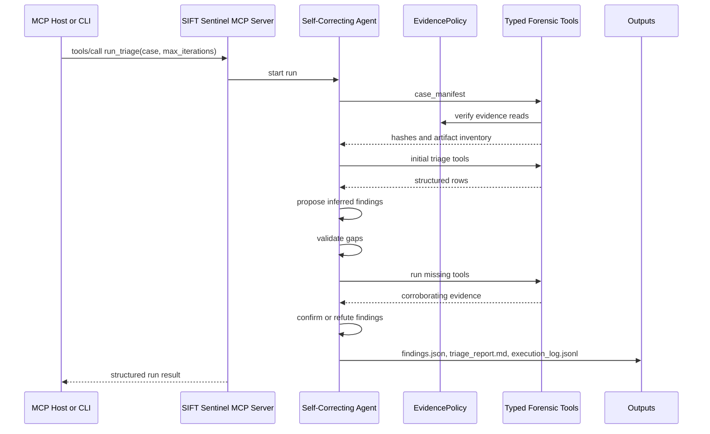

# Architecture

## Pattern

SIFT Sentinel uses the challenge's **Custom MCP Server** pattern as the primary architecture. It also includes a self-correcting triage loop and benchmark harness because those two pieces make the autonomy measurable.

## Components

- `sift_sentinel.mcp_server`: MCP stdio server with typed tools.
- `sift_sentinel.agent`: autonomous triage loop with validation and self-correction.
- `sift_sentinel.tools`: read-only structured forensic tools over parsed artifacts.
- `sift_sentinel.policies`: evidence integrity guardrail.
- `sift_sentinel.runners`: safe subprocess runner for real SIFT tools.
- `sift_sentinel.sift_wrappers`: narrow Volatility and EvtxECmd wrappers.
- `sift_sentinel.scoring`: accuracy and hallucination benchmark.

## Trust Boundaries

| Boundary | Enforcement | Type |
|---|---|---|
| Evidence root is read-only | `EvidencePolicy.assert_readable_evidence` and `assert_output_path` | Architectural |
| Output root is the only write target | `EvidencePolicy.assert_output_path` | Architectural |
| No arbitrary command execution | MCP server exposes typed tools only | Architectural |
| SIFT subprocesses use argv arrays | `SafeSubprocessRunner`, `shell=False` | Architectural |
| Volatility plugin choices are allowlisted | `VOLATILITY_PLUGINS` | Architectural |
| Claims must cite evidence refs | validation and scoring require tool call IDs | Architectural |
| Analyst behavior and sequencing | deterministic agent loop and docs | Prompt-independent |

Prompt-based guidance can still improve the host model's behavior, but the core safety properties do not depend on prompt obedience.

## Execution Flow

## Self-Correction Example

Iteration 1 creates four inferred findings:

- Winupdate external callback
- Prefetch-only `C:\Users\Public\svchost.exe`
- Encoded PowerShell execution
- Rundll32 loading `SyncCache.dll`

The validator refuses to confirm them until missing evidence is collected:

- External callback needs `memory_malfind`, `disk_amcache`, and `disk_timeline`.
- Prefetch-only masquerade lead needs `disk_amcache` and `disk_timeline`.
- Rundll32 execution needs `registry_run_keys`.

Iteration 2 updates the findings:

- `F-001` becomes confirmed after malfind, hash, and timeline evidence.
- `F-002` becomes refuted because no Amcache or timeline record supports the suspicious svchost path.
- `F-003` becomes confirmed after registry Run key evidence.
- `F-004` becomes confirmed after process and timeline corroboration.

The full trace is in `cases/demo-case/outputs/demo-run/analysis/execution_log.jsonl`.

